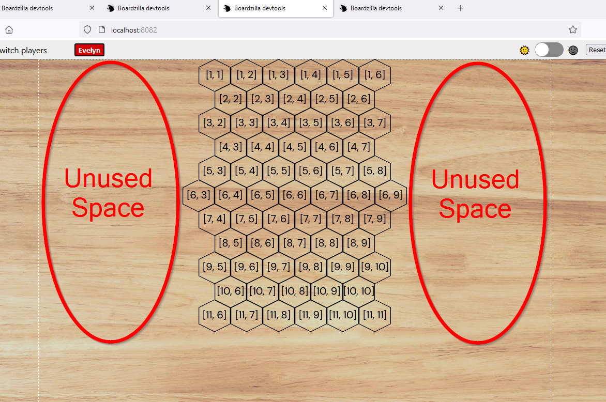
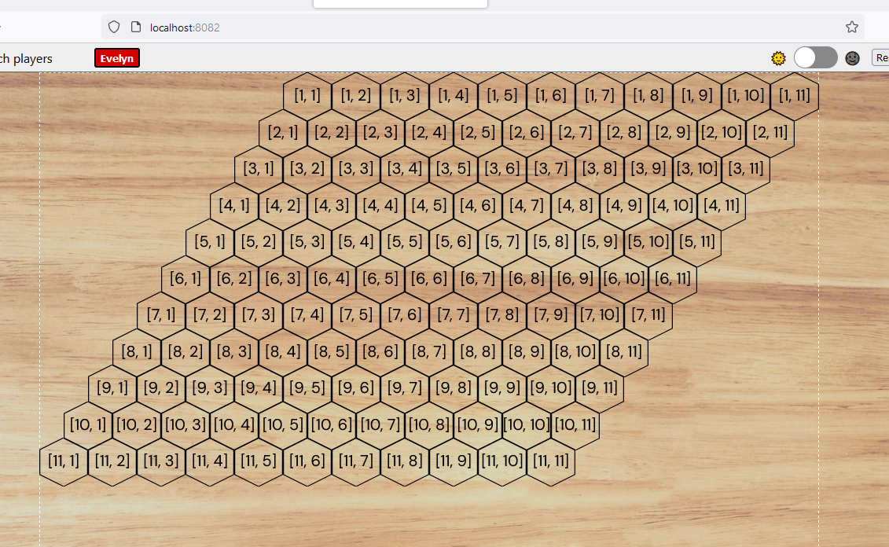

### Hex Grid Test

This repo is me attempting to configure a boardzilla game that uses a hex grid that lets me use a column of hexes. I'm looking for suggestions about how to reclaim the horizontal part of a hex board grid I am setting up.

The problem I am having is that I lose a lot of horizontal space due to these destroyed hexes that are presumably still accounted for in the layout geometry. It seems like the layout is based on the initial hex grid and doesn't account for spaces destroyed after the board has been created.

See line 40 in [`src/game/index.ts`](./src/game/index.ts) for where to keep/destroy the hexes I don't want to use for my game example.

I figured out I can overlay other baord components over the missing area, but that gets away from the nice modular nature of the `Space` I'd like to have.

My desired layout (destroyed one are missing)

The ones I started with when I created the grid.

